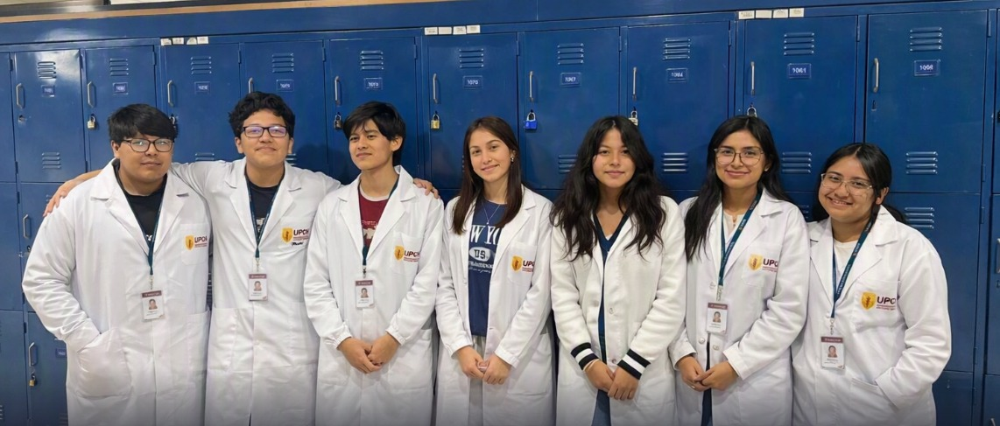
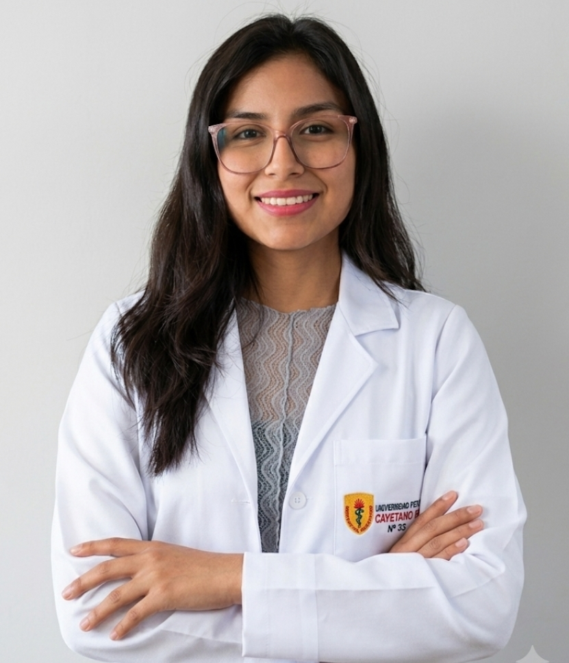
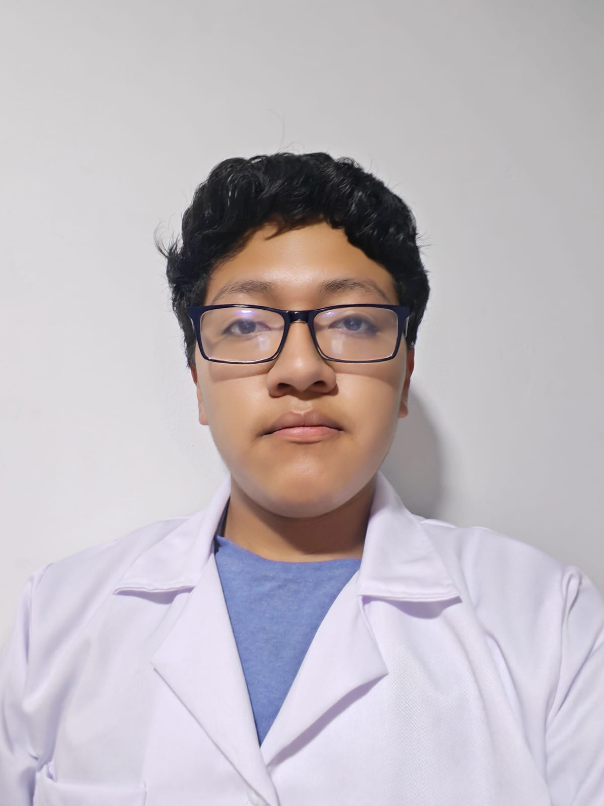
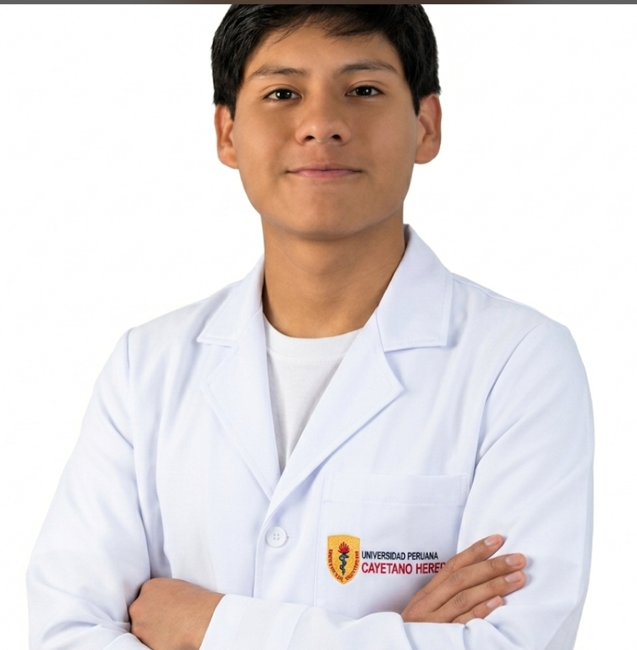
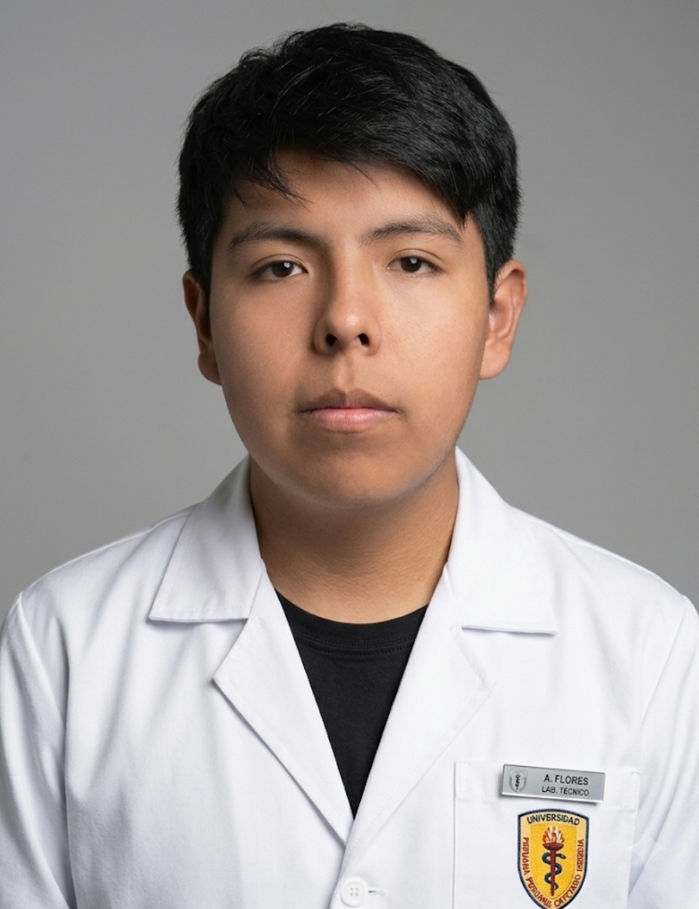

# Equipo 4 - PI

### Carrera de Ingeniería **Biomedica**
**Universidad Peruana Cayetano Heredia**

---

## Descripción del Equipo

Somos el **Equipo 4** del curso **Procesos de innovacion**, conformado por estudiantes de la carrera de Ingeniería **Biomedica**. Nuestro objetivo es aplicar la metodología de investigación para resolver problemas de ingeniería.

Nos interesa trabajar en los siguientes **Objetivos de Desarrollo Sostenible (ODS):**

* ODS 3: Salud y Bienestar
* ODS 6: Agua Limpia y Saneamiento
* ODS 9: Industria, Innovación e Infraestructura
* ODS 11: Ciudades y Comunidades Sostenibles
* ODS 13: Acción por el Clima

---

## Fotografía del Equipo

---

## Integrantes del Equipo

| Foto | Nombre | Rol | Intereses |
| :---: | :--- | :--- | :--- |
|  | **Sophia Alejandra** | Líder del equipo | Innovación social, sostenibilidad |
|  | **Brandom Onofre** | Responsable de investigación | Gestión ambiental, desarrollo comunitario |
|  | **Leonardo** | Diseñador | Diseño de prototipos, creatividad aplicada |
|  | **Sebastian** | Documentación | Comunicación científica, redacción técnica |

---

## Resumen Final

Este README resume quiénes somos, qué nos motiva y en qué ODS queremos enfocar nuestro trabajo durante el curso.
